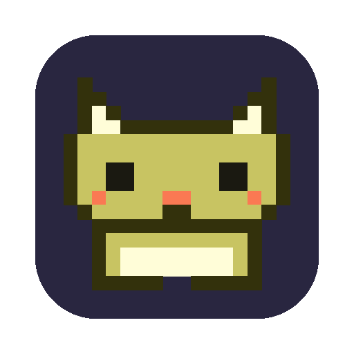
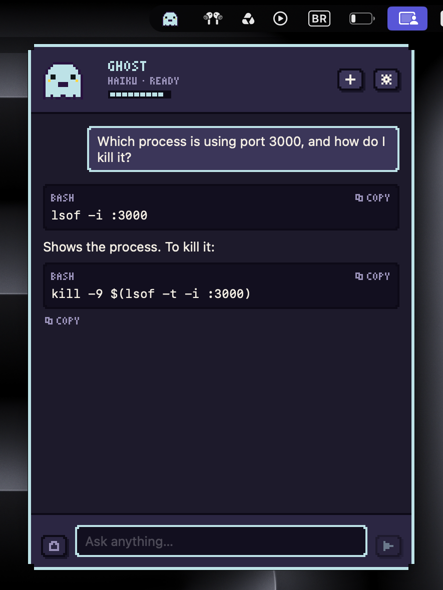
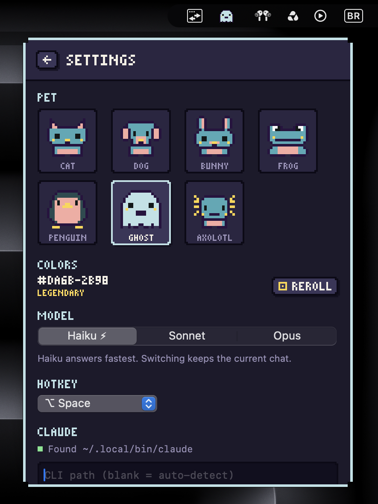
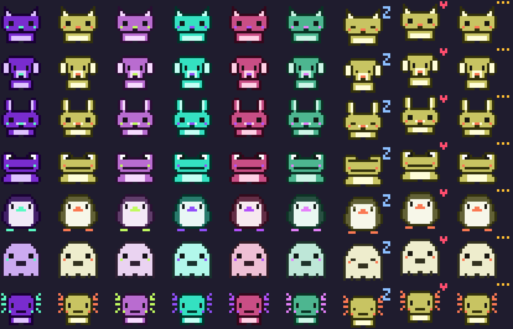

<p align="center">
  
</p>

<h1 align="center">Kibbit</h1>

<p align="center">
  A pixel-art pet that lives in the macOS menu bar and answers quick questions using your Claude subscription, so you don't have to leave your terminal or editor.
</p>

<p align="center"><i>kibble + kibitz: a pet that chimes in with answers.</i></p>

<p align="center">
  
  
</p>

<p align="center">
  
</p>

- 7 pets: cat, dog, bunny, frog, penguin, ghost, axolotl
- Colors are generated from a random seed (`#XXXX-XXXX`). Reroll to hatch a new palette. About 15% of seeds are **rare** and 3% are **legendary**.
- Animated: idle breathing, blinking, a thinking bounce, typing, a heart when an answer finishes, and sleeping after 10 minutes idle.
- A tiny chat with streamed answers, copyable code blocks, and an optional clipboard attachment for context.
- The energy bar shows how much of your 5-hour subscription window is left.

## Requirements

- macOS 14+ and the Swift toolchain (Command Line Tools are enough; you don't need Xcode)
- [Claude Code](https://claude.com/claude-code), signed in (`claude` → `/login`)

## Build & run

```bash
./scripts/build-app.sh            # → build/Kibbit.app
./scripts/build-app.sh --install  # → /Applications/Kibbit.app and launch
```

## Use

| Key | Action |
| --- | --- |
| `⌥ Space` | summon / dismiss from anywhere (changeable in Settings) |
| `↩` | send |
| `⌘⇧V` | attach clipboard as context |
| `⌘.` | stop the answer |
| `⌘N` | new chat |
| `⌘,` | settings |
| `esc` | back to work |

Right-click the pet in the menu bar for a menu.

## How it talks to Claude

Kibbit doesn't call the API directly. It keeps one warm `claude -p` process running in stream-JSON mode, so it uses exactly the same auth as Claude Code (your subscription login). Because the process is already running, the first token arrives in about 1 second instead of the roughly 4 seconds a cold start takes. The process runs with no tools, no MCP servers, and no user settings or hooks, using a short "answer tersely" system prompt. `ANTHROPIC_API_KEY` is removed from its environment so nothing gets billed to an API key by accident.

If Claude Code isn't signed in on this machine, run `claude setup-token` and paste the token in Settings. It's stored in the Keychain.

The warm process shuts down after 15 idle minutes. Your next question resumes the same conversation with `--resume`.

## Development

```bash
swift build
.build/debug/Kibbit --render-gallery /tmp/pets.png   # all pets × seeds × animation frames
open build/Kibbit.app --args --ask "question"        # smoke test: opens the panel and sends
```

Sprites live in `Sources/Kibbit/Pets.swift` as the left halves of 16×16 grids, mirrored when drawn.

## License

[MIT](LICENSE)
